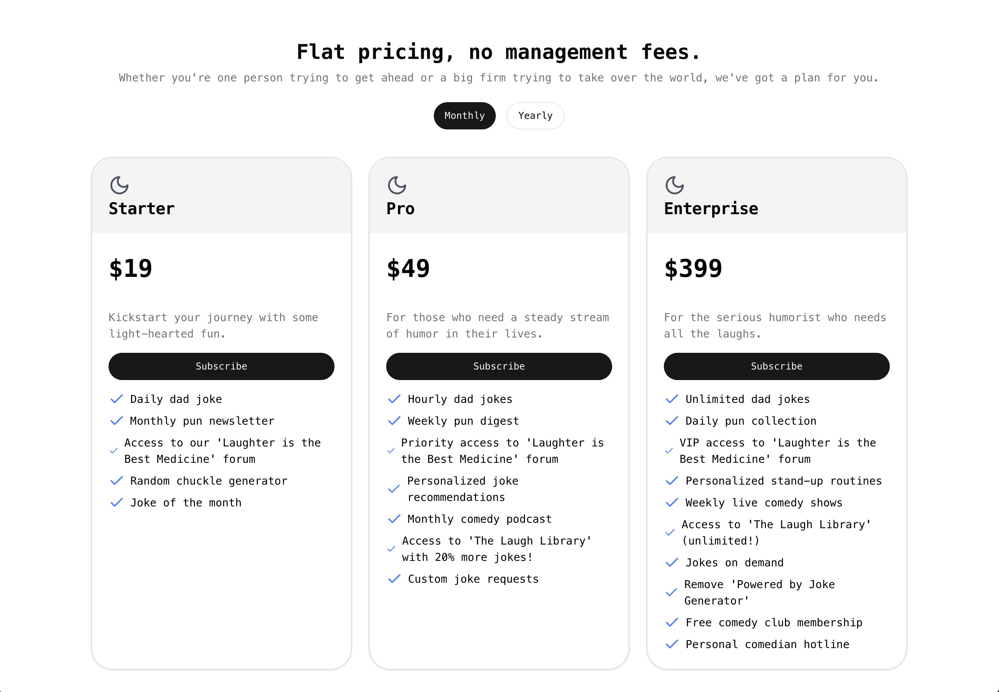
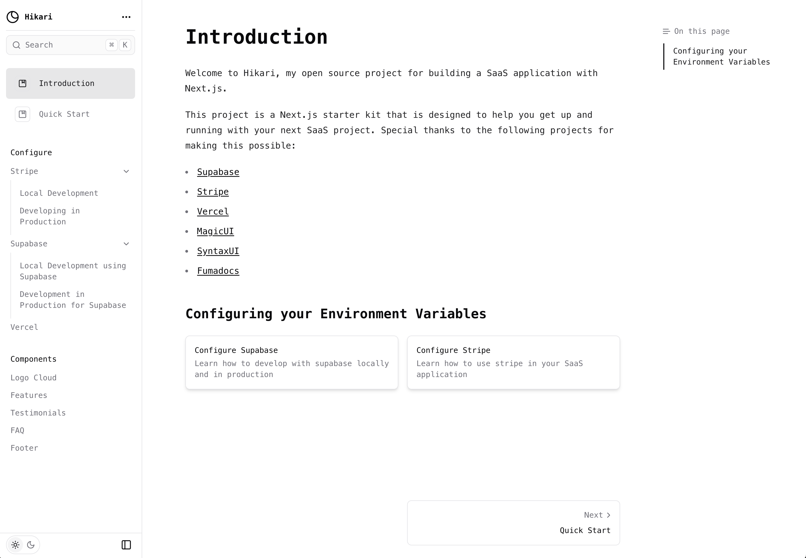
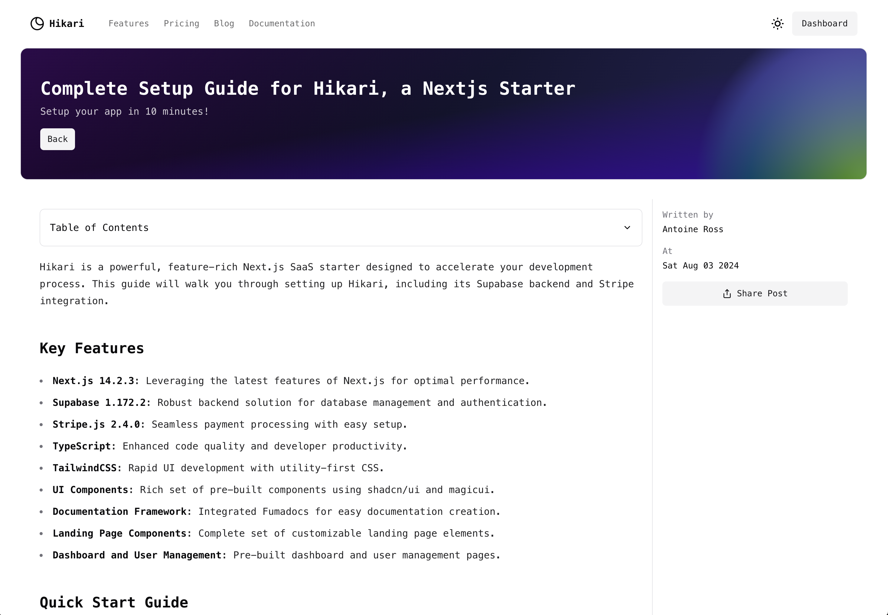

# 🚀 Complete Next.js Subscription Starter Template

The all-in-one starter kit for building high-performance SaaS applications using Next.js, TailwindCSS, and Supabase.

> **Warning**: This app is a work in progress. I'm building this in public. Follow the progress on Twitter [@antoineross\_\_](https://twitter.com/antoineross__). Check out the features below.

## 🎉 Features

- 🔐 **Complete Auth Package**: Secure user management and authentication with [Supabase](https://supabase.io/docs/guides/auth)
- 🛠️ **Data Management**: Powerful data access & management tooling on top of PostgreSQL with [Supabase](https://supabase.io/docs/guides/database)
- 💳 **Stripe Integration**: Seamless integration with [Stripe Checkout](https://stripe.com/docs/payments/checkout) and the [Stripe customer portal](https://stripe.com/docs/billing/subscriptions/customer-portal)
- 🌐 **Pricing & Subscriptions**: Automatic syncing of pricing plans and subscription statuses via [Stripe webhooks](https://stripe.com/docs/webhooks)
- 🌈 **TailwindCSS & Tailwind UI**: Customized and flexible UI components with Tailwind UI
- ⚛️ **React 18**: Enjoy the latest features and improvements with React 18
- 📘 **TypeScript**: Strongly typed programming for better development experience
- 🎨 **Shadcn/ui**: Beautiful and customizable UI components
- 🔍 **Zod Validation**: Schema validation to keep your data safe and sound
- 🧪 **Testing Tools**: Integrated unit and e2e testing with Jest, React Testing Library, and Playwright
- 🧑‍💻 **Developer Experience**: ESLint, Prettier, Husky, and Commitlint for maintaining code quality and consistency
- 📀 **Supabase storage** - Included are setting up policies, and handling image compression in the browser.
- ⼬ **tRPC** - Included a guide on how to add a very lean trpc router for your api. You just need to add 3 folders, and 1 file.
- ⚙️ **Local Development**: Develop locally with Supabase, Docker, and a set of custom commands
- 📚 **Documentation & Blog**: Utilize MDX compiler from the open-source project Fumadocs for documentation and blog content.

## 🎬 Demo

[Live Demo](https://hikari.antoineross.com/)

**Hero Section:** 

**Dashboard View:** 

**Pricing Table:** 

**Documentation:** 

**Blog:** 

## 📄 Quick Start Guide

Get up and running quickly by following the [Quick Start Guide](https://hikari.antoineross.com/docs/quick-start).

## 🚀 Going Live

### **1. Archive Testing Products**

Before going live, archive all test mode Stripe products. Switch Stripe from test mode to production mode and update your environment variables.

### **2. Redeploy**

After updating environment variables, redeploy your application through Vercel.

## 📚 Additional Features

- 📈 **Analytics Ready**: Easy integration with analytics tools like Google Analytics
- 🌐 **I18n Support**: Built-in internationalization with Paraglide
- 🔥 **Lighthouse Performance**: Achieve a perfect score with optimized performance, accessibility, and SEO

## 🤝 Contribution

To contribute:

1. Fork the repository.
2. Create a new branch.
3. Make your changes and commit them.
4. Push to the forked repository.
5. Create a pull request.

## ❤️ Support

If you like the project, consider leaving a star. 🌟

Made by [Antoine Ross](https://antoineross.com).
